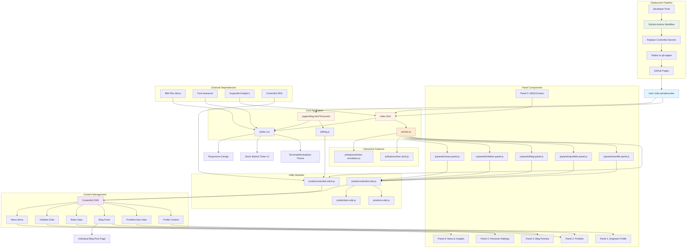

# Personal Portfolio Website

🚀 Welcome to the codebase for my personal portfolio website! 🚀

A terminal/workstation-themed personal website featuring a unique stock market ticker design that showcases my professional experience, projects, and blog posts. Built with vanilla JavaScript and integrated with Contentful CMS for dynamic content management.

## ✨ Features

### 🖥️ Terminal/Workstation Theme
- **Stock market ticker interface** - Financial market-inspired design with live status indicators
- **Interactive panels** - Six main sections: Profile, Portfolio, Blog, Personal Holdings, Contact, and News & Insights
- **Dynamic time display** - Real-time local time in the header
- **Animated tickers** - Sliding animations showcasing skills and interests

### 📝 Content Management
- **Contentful CMS integration** - Dynamic content loading for portfolio and blog
- **Blog system** - Individual blog post pages with rich text rendering
- **Portfolio showcase** - Job experience and roles dynamically loaded from CMS

### 🎨 Design & UX
- **Monospace typography** - IBM Plex Mono font for authentic terminal feel
- **Responsive design** - Mobile and desktop optimized
- **CSS animations** - Smooth transitions and engaging visual effects
- **Font Awesome icons** - Professional iconography

### 🔧 Development & Deployment
- **GitHub Actions CI/CD** - Automated deployment to GitHub Pages
- **Custom domain** - Deployed at penaloza.dev

## 🛠️ Tech Stack

*   **Frontend:** HTML5, CSS3, Vanilla JavaScript
*   **Fonts:** IBM Plex Mono (Google Fonts)
*   **Icons:** Font Awesome 6
*   **CMS:** Contentful Headless CMS
*   **Analytics:** Inspectlet
*   **Deployment:** GitHub Pages with GitHub Actions
*   **Domain:** Custom domain with CNAME

## 📁 Project Structure

```
personal-site/
├── index.html              # Main landing page
├── styles.css              # Main stylesheet
├── favicon.ico             # Site favicon
├── CNAME                   # Custom domain configuration
├── pages/                  # Secondary HTML pages
│   └── blog.html          # Blog post template page
├── js/                     # Modular JavaScript architecture
│   ├── main.js            # Main application coordination
│   ├── blog.js            # Blog-specific JavaScript
│   ├── utils/             # Shared utility functions
│   │   ├── contentful-client.js # Contentful CMS client setup
│   │   ├── contentful-utils.js  # Contentful API utilities
│   │   ├── dom-utils.js         # DOM manipulation utilities
│   │   └── ui-utils.js          # UI state management utilities
│   ├── panels/            # Content panel modules
│   │   ├── profile-panel.js    # Profile rendering logic
│   │   ├── portfolio-panel.js  # Portfolio/jobs rendering logic
│   │   ├── hobbies-panel.js    # Hobbies rendering logic
│   │   ├── news-panel.js       # News rendering logic
│   │   └── blog-panel.js       # Blog posts rendering logic
│   └── features/          # Interactive feature modules
│       ├── live-clock.js       # Real-time clock functionality
│       └── ticker-simulation.js # Stock ticker simulation
├── .github/
│   └── workflows/
│       └── deploy.yml      # GitHub Actions deployment workflow
└── README.md               # This file
```

## 🏗️ Architecture & Data Flow

The following diagram illustrates how the website components interact and how content flows from Contentful CMS to the user interface:



## 🏃‍♂️ Running Locally

### Quick Start
1.  **Clone the repository:**
    ```bash
    git clone https://github.com/apenaloza7/personal-site.git
    cd personal-site
    ```

2.  **Open `index.html`:**
    Simply open the `index.html` file directly in your web browser.
    
    > **Note:** The site will work without Contentful setup, but dynamic content (portfolio, blog) won't load.

### Full Setup with Contentful
To enable dynamic content loading:

1.  **Set up Contentful account** at [contentful.com](https://www.contentful.com/)

2.  **Update Contentful credentials** in `contentful-client.js`:
    ```javascript
    const CONTENTFUL_SPACE_ID = 'your_actual_space_id';
    const CONTENTFUL_ACCESS_TOKEN = 'your_actual_access_token';
    ```

3.  **Create content types** in Contentful:
    - `profile` - For personal information
    - `job` - For work experience  
    - `role` - For specific job roles
    - `blogPost` - For blog entries
    - `hobby` - For personal interests and hobbies
    - `newsItem` - For news and insights content

## 🚀 Deployment

This site uses GitHub Actions for automated deployment:

1. **Push to main branch** triggers automatic deployment
2. **Contentful credentials** are injected via GitHub Secrets during build
3. **Deployed to GitHub Pages** on the `gh-pages` branch
4. **Custom domain** configured via CNAME file

### GitHub Secrets Required:
- `CONTENTFUL_SPACE_ID`
- `CONTENTFUL_ACCESS_TOKEN`

## 🔗 Links

*   **🌐 Live Site:** [penaloza.dev](https://penaloza.dev)
*   **💼 LinkedIn:** [Alejandro Penaloza](https://www.linkedin.com/in/penalozaalejandro/)
*   **🐙 GitHub:** [apenaloza7](https://github.com/apenaloza7)
*   **📺 YouTube:** [@penapoppin](https://www.youtube.com/@penapoppin)

---

Built with ❤️ and [Cursor](https://www.cursor.com/) by Alejandro Penaloza 💻
