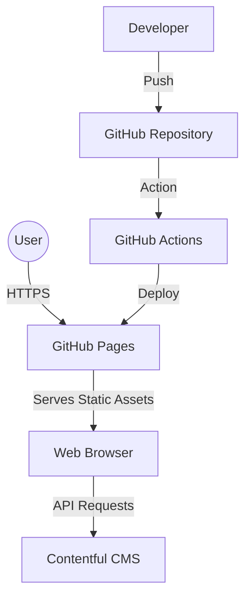
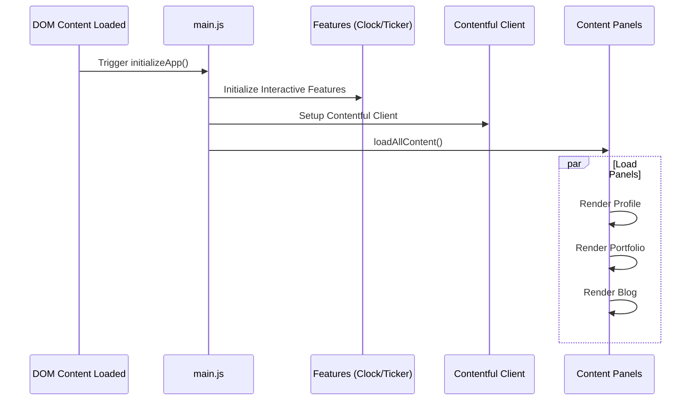
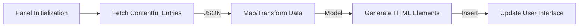

# Personal Portfolio Website

This codebase contains the source for a personal portfolio website designed with a financial workstation theme. The application features a real-time stock ticker interface, interactive panels for professional experience and projects, and a dynamic blog system. It is built using vanilla JavaScript and integrates with Contentful as a headless CMS for content management.

## System Architecture

The following diagram illustrates the high-level architecture of the system, showing the relationships between the user, the hosting infrastructure (GitHub Pages), and the data source (Contentful).



## Technical Overview

### Tech Stack

-   **Frontend:** HTML5, CSS3, Vanilla JavaScript
-   **CMS:** Contentful (Headless CMS)
-   **Analytics:** Inspectlet
-   **Deployment:** GitHub Pages via GitHub Actions
-   **Typography:** IBM Plex Mono (Google Fonts)

### Project Structure

The project maintains a modular structure to separate concerns between styling, logic, and content handling.

```
personal-site/
├── index.html              # Main application entry point
├── styles.css              # Core styling definitions
├── js/
│   ├── main.js            # Application bootstrapper
│   ├── utils/             # Shared utilities (CMS client, DOM helpers)
│   ├── panels/            # UI component logic (Profile, Portfolio, Blog)
│   └── features/          # Interactive elements (Clock, Ticker)
└── pages/
    └── blog.html          # Individual blog post template
```

## Application Logic

### Initialization Sequence

Upon loading, the application initializes interactive features (like the clock and ticker) and content panels concurrently. This ensures a responsive user experience while data is being fetched.



### Data Pipeline

Data flows from the CMS to the user interface through a standardized pipeline of fetching, normalization, and rendering.

